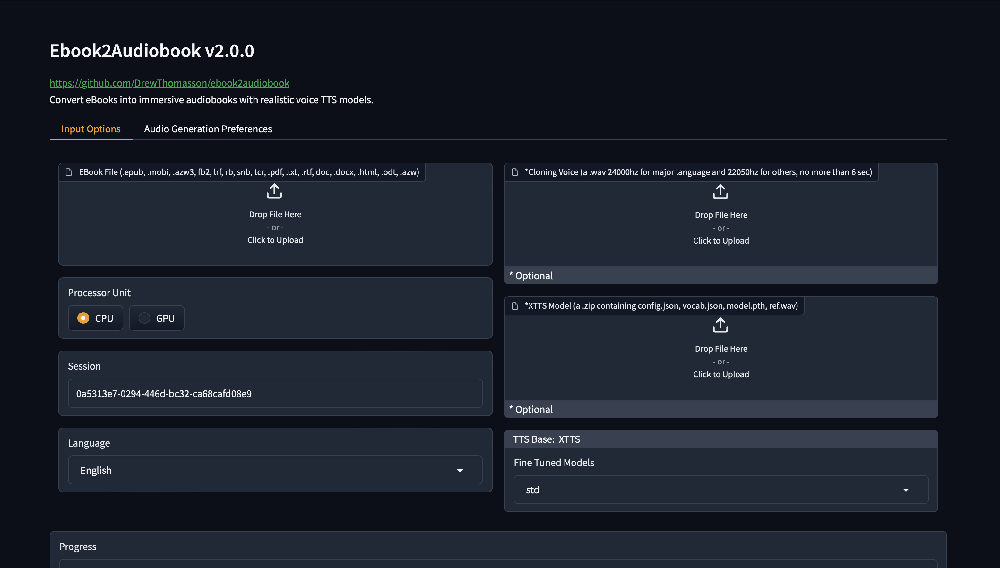
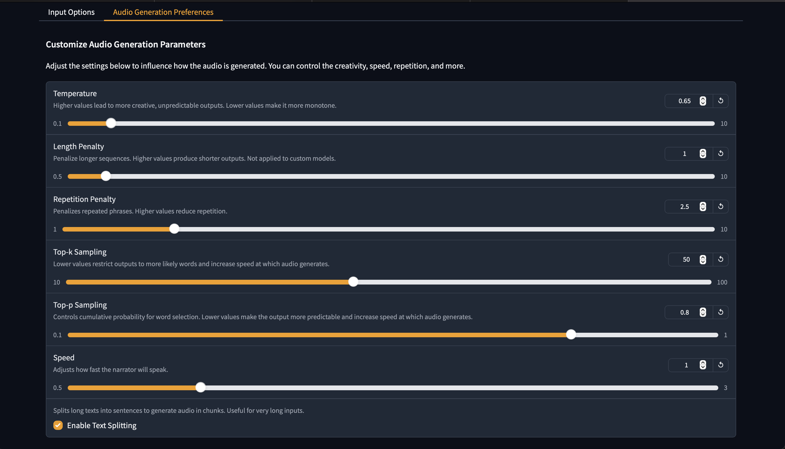
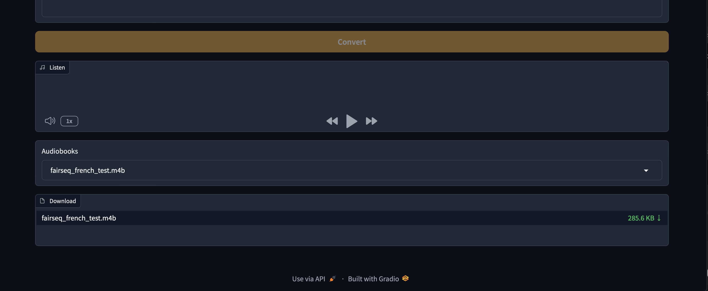

# 📚 ebook2audiobook (E2A)
Convertisseur CPU/GPU d'ebook en livre audio avec chapitres et métadonnées,<br/>
utilisant des moteurs TTS avancés et bien plus encore.<br/>
Supporte le clonage de voix et 1158 langues !

> [!IMPORTANT]
**Cet outil est destiné uniquement aux livres numériques légalement acquis, sans DRM.**<br>
Les auteurs déclinent toute responsabilité en cas de mauvaise utilisation ou de conséquences juridiques.<br>
Utilisez cet outil de manière responsable et conformément aux lois applicables.

[](https://discord.gg/63Tv3F65k6)

### Soutenir les développeurs d'ebook2audiobook !
[](https://ko-fi.com/athomasson2)

### Lancer localement

[](#instructions)

[](https://github.com/DrewThomasson/ebook2audiobook/actions/workflows/Docker-Build.yml)  [](https://github.com/DrewThomasson/ebook2audiobook/releases/latest)

<a href="https://github.com/DrewThomasson/ebook2audiobook">
  
</a><a href="https://hub.docker.com/r/athomasson2/ebook2audiobook">

</a>

### Lancer à distance
[](https://huggingface.co/spaces/drewThomasson/ebook2audiobook)
[](https://colab.research.google.com/github/DrewThomasson/ebook2audiobook/blob/main/Notebooks/colab_ebook2audiobook.ipynb)
[](https://github.com/Rihcus/ebook2audiobookXTTS/blob/main/Notebooks/kaggle-ebook2audiobook.ipynb)

#### Interface graphique


<details>
  <summary>Cliquer pour voir les captures d'écran de l'interface</summary>
  
  
  
</details>

---

## Table des matières
- [Fonctionnalités](#fonctionnalités)
- [Configuration matérielle requise](#configuration-matérielle-requise)
- [Langues supportées](#langues-supportées)
- [Formats d'ebook supportés](#formats-debook-supportés)
- [Formats de sortie](#formats-de-sortie)
- [Tags SML](#tags-sml)
- [Instructions d'utilisation](#instructions)
  - [Lancer localement](#instructions)
  - [Mode GUI Gradio](#instructions)
  - [Mode sans interface (headless)](#utilisation-de-base)
  - [Docker](#docker)
- [Modèles TTS affinés](#modèles-tts-affinés)
- [Personnalisation](#personnalisation)
- [Problèmes fréquents](#problèmes-fréquents)
- [Nouveautés v26.5.20](#nouveautés-v26520)
- [Feuille de route](#feuille-de-route)

---

## Fonctionnalités
- 🔧 **Moteurs TTS supportés** : `XTTSv2`, `Bark`, `Fairseq`, `VITS`, `Tacotron2`, `Tortoise`, `GlowTTS`, `YourTTS`
- 📚 **Formats de fichiers convertibles** : `.epub`, `.mobi`, `.azw3`, `.fb2`, `.lrf`, `.rb`, `.snb`, `.tcr`, `.pdf`, `.txt`, `.rtf`, `.doc`, `.docx`, `.html`, `.odt`, `.azw`, `.tiff`, `.tif`, `.png`, `.jpg`, `.jpeg`, `.bmp`
- 💻 **Zone de texte** pour convertir directement un texte court en audio
- 🔍 **Scan OCR** pour les fichiers dont les pages de texte sont des images
- 🔊 **Synthèse vocale de haute qualité**, du quasi-temps-réel à la voix quasi-réelle
- 🗣️ **Clonage de voix optionnel** avec votre propre fichier audio
- 🌐 **Supporte 1158 langues** ([liste des langues supportées](https://dl.fbaipublicfiles.com/mms/tts/all-tts-languages.html))
- 💻 **Peu gourmand en ressources** — fonctionne avec **2 Go de RAM / 1 Go de VRAM (minimum)**
- 🎵 **Formats de sortie audio** : mono ou stéréo `aac`, `flac`, `mp3`, `m4b`, `m4a`, `mp4`, `mov`, `ogg`, `wav`, `webm`
- 🧠 **Tags SML supportés** — contrôle fin des pauses, silences, changements de voix ([voir ci-dessous](#tags-sml))
- 🧩 **Modèle personnalisé optionnel** avec votre propre modèle entraîné (XTTSv2 uniquement, autres sur demande)
- 🎛️ **Modèles pré-entraînés** par l'équipe E2A<br/>
     <i>(Contactez-nous si vous avez besoin de modèles supplémentaires, ou si vous souhaitez partager le vôtre)</i>

---

## Configuration matérielle requise
- 2 Go de RAM minimum, 8 Go recommandés.
- 1 Go de VRAM minimum, 4 Go recommandés.
- Virtualisation activée si vous utilisez Windows (Docker uniquement).
- CPU, XPU (Intel, AMD, ARM)*.
- CUDA, ROCm, JETSON
- MPS (Apple Silicon)

*<i>Les moteurs TTS modernes sont très lents sur CPU — préférez des moteurs plus légers comme YourTTS ou Tacotron2.</i>

---

## Langues supportées
| **Arabe (ar)**       | **Chinois (zh)**     | **Anglais (en)**    | **Espagnol (es)**   |
|:--------------------:|:--------------------:|:-------------------:|:-------------------:|
| **Français (fr)**    | **Allemand (de)**    | **Italien (it)**    | **Portugais (pt)**  |
| **Polonais (pl)**    | **Turc (tr)**        | **Russe (ru)**      | **Néerlandais (nl)**|
| **Tchèque (cs)**     | **Japonais (ja)**    | **Hindi (hi)**      | **Bengali (bn)**    |
| **Hongrois (hu)**    | **Coréen (ko)**      | **Vietnamien (vi)** | **Suédois (sv)**    |
| **Persan (fa)**      | **Yoruba (yo)**      | **Swahili (sw)**    | **Indonésien (id)** |
| **Slovaque (sk)**    | **Croate (hr)**      | **Tamoul (ta)**     | **Danois (da)**     |
- [**+1130 autres langues et dialectes**](https://dl.fbaipublicfiles.com/mms/tts/all-tts-languages.html)

---

## Formats d'ebook supportés
- `.epub`, `.pdf`, `.mobi`, `.txt`, `.html`, `.rtf`, `.chm`, `.lit`,
  `.pdb`, `.fb2`, `.odt`, `.cbr`, `.cbz`, `.prc`, `.lrf`, `.pml`,
  `.snb`, `.cbc`, `.rb`, `.tcr`
- **Meilleurs résultats** : `.epub` ou `.mobi` pour la détection automatique des chapitres

## Formats de sortie
- `.m4b`, `.m4a`, `.mp4`, `.webm`, `.mov`, `.mp3`, `.flac`, `.wav`, `.ogg`, `.aac`
- Le format de traitement peut être modifié dans `lib/conf.py`

---

## Tags SML
Les tags SML permettent un contrôle précis de la synthèse vocale, directement dans le texte source.

| Tag | Effet |
|-----|-------|
| `[break]` | Silence court (durée aléatoire **0,3–0,6 sec.**) |
| `[pause]` | Silence long (durée aléatoire **1,0–1,6 sec.**) |
| `[pause:N]` | Pause fixe de **N secondes** |
| `[voice:/chemin/vers/voix]...[/voice]` | Changer de voix sur un passage |

**Voir aussi notre dépôt dédié à l'ajout automatique de tags SML dans vos ebooks → [E2A-SML](https://github.com/DrewThomasson/E2A-SML)**

> [!NOTE]
**Avant de signaler un problème d'installation ou un bug, cherchez soigneusement dans les issues ouvertes et fermées<br>
pour vérifier que le problème n'existe pas déjà.**

> [!NOTE]
**Le format EPUB ne dispose d'aucune structure standard définissant ce qu'est un chapitre, un paragraphe, une préface, etc.<br>
Il est recommandé de supprimer manuellement le texte que vous ne souhaitez pas convertir en audio.**

---

## Instructions

### 1. Cloner le dépôt
```bash
git clone https://github.com/DrewThomasson/ebook2audiobook.git
cd ebook2audiobook
```

### 2. Installer / Lancer ebook2audiobook

**Linux/macOS**
```bash
./ebook2audiobook.command
```
*Note pour macOS : Homebrew est installé automatiquement pour les programmes manquants.*

**Lanceur macOS**
Double-cliquez sur `Mac Ebook2Audiobook Launcher.command`

**Windows**
```bat
ebook2audiobook.cmd
```
ou double-cliquez sur `ebook2audiobook.cmd`

*Note pour Windows : Scoop est installé automatiquement pour les programmes manquants, sans droits administrateur.*

### 3. Ouvrir l'interface Web
Cliquez sur l'URL affichée dans le terminal : `http://localhost:7860/`

### 4. Lien public (partage)
```bash
# Linux/macOS
./ebook2audiobook.command --share
# Windows
ebook2audiobook.cmd --share
# Tous OS
python app.py --share
```

> [!IMPORTANT]
**Si le script est arrêté puis relancé, vous devez rafraîchir l'interface Gradio<br>
pour que la page web se reconnecte au nouveau socket.**

---

## Utilisation de base

**Linux/macOS :**
```bash
./ebook2audiobook.command --headless --ebook <chemin_ebook> --voice <chemin_voix> --language <code_langue>
```

**Windows :**
```bat
ebook2audiobook.cmd --headless --ebook <chemin_ebook> --voice <chemin_voix> --language <code_langue>
```

| Paramètre | Description |
|-----------|-------------|
| `--ebook` | Chemin vers votre fichier ebook |
| `--voice` | Fichier audio pour le clonage de voix (optionnel) |
| `--language` | Code langue ISO-639-3 (ex. : `fra` pour français, `eng` pour anglais, `deu` pour allemand…)<br>Les codes ISO-639-1 à 2 lettres sont aussi acceptés. |

### Exemple avec modèle personnalisé (zip)
Le fichier zip doit contenir les fichiers du modèle obligatoires. Pour XTTSv2 : `config.json`, `model.pth`, `vocab.json` et `ref.wav`.

**Linux/macOS :**
```bash
./ebook2audiobook.command --headless --ebook <chemin_ebook> --language <langue> --custom_model <chemin_modele.zip>
```

**Windows :**
```bat
ebook2audiobook.cmd --headless --ebook <chemin_ebook> --language <langue> --custom_model <chemin_modele.zip>
```

*Note : le fichier `ref.wav` de votre modèle personnalisé est toujours utilisé comme voix de référence.*

### Aide complète
```bash
# Linux/macOS
./ebook2audiobook.command --help
# Windows
ebook2audiobook.cmd --help
# Tous OS
python app.py --help
```

---

## Docker

### 1. Cloner le dépôt
```bash
git clone https://github.com/DrewThomasson/ebook2audiobook.git
cd ebook2audiobook
```

### 2. Construire le conteneur
```bash
# Windows - Docker simple :
ebook2audiobook.cmd --script_mode build_docker
# Windows - Docker Compose :
ebook2audiobook.cmd --script_mode build_docker --docker_mode compose
# Windows - Podman Compose :
ebook2audiobook.cmd --script_mode build_docker --docker_mode podman

# Linux/Mac - Docker simple :
./ebook2audiobook.command --script_mode build_docker
# Linux/Mac - Docker Compose :
./ebook2audiobook.command --script_mode build_docker --docker_mode compose
# Linux/Mac - Podman Compose :
./ebook2audiobook.command --script_mode build_docker --docker_mode podman
```

### 3. Lancer le conteneur

```bash
# Mode GUI/Gradio - CPU :
docker run -v "./ebooks:/app/ebooks" -v "./audiobooks:/app/audiobooks" \
  -v "./models:/app/models" -v "./voices:/app/voices" -v "./tmp:/app/tmp" \
  --rm -it -p 7860:7860 athomasson2/ebook2audiobook:cpu

# Mode GUI/Gradio - CUDA :
docker run ... --gpus all athomasson2/ebook2audiobook:cu130

# Mode GUI/Gradio - ROCm :
docker run ... --device=/dev/kfd --device=/dev/dri athomasson2/ebook2audiobook:rocm6.4

# Mode GUI/Gradio - XPU (Intel) :
docker run ... --device=/dev/dri athomasson2/ebook2audiobook:xpu

# Mode GUI/Gradio - JETSON :
docker run ... --runtime nvidia athomasson2/ebook2audiobook:jetson61

# Mode headless (sans interface) - CPU :
docker run -v "./ebooks:/app/ebooks" -v "./audiobooks:/app/audiobooks" \
  -v "./models:/app/models" -v "./voices:/app/voices" -v "./tmp:/app/tmp" \
  --rm -it -p 7860:7860 athomasson2/ebook2audiobook:cpu \
  --headless --ebook "/app/ebooks/monlivre.epub" [--voice /app/voices/mavoix.wav ...]
```

**Docker Compose (ex. CUDA 12.8) :**
```bash
# Interface graphique :
DEVICE_TAG=cu128 docker compose --profile gpu up --no-log-prefix
# Mode headless :
DEVICE_TAG=cu128 docker compose --profile gpu run --rm ebook2audiobook \
  --headless --ebook "/app/ebooks/monlivre.epub" ...
```

*Note : MPS (Apple Silicon) n'est pas exposé dans Docker — utilisez le profil CPU.*

### Problèmes Docker courants
- Mon GPU NVIDIA/ROCm/XPU n'est pas détecté ? → [Page Wiki GPU ISSUES](https://github.com/DrewThomasson/ebook2audiobook/wiki/GPU-ISSUES)

---

## Modèles TTS affinés

### Affiner votre propre modèle XTTSv2
[](https://huggingface.co/spaces/drewThomasson/xtts-finetune-webui-gpu)
[](https://github.com/DrewThomasson/ebook2audiobook/blob/v25/Notebooks/finetune/xtts/kaggle-xtts-finetune-webui-gradio-gui.ipynb)
[](https://colab.research.google.com/github/DrewThomasson/ebook2audiobook/blob/v25/Notebooks/finetune/xtts/colab_xtts_finetune_webui.ipynb)

### Débruiter vos données d'entraînement
[](https://huggingface.co/spaces/drewThomasson/DeepFilterNet2_no_limit)
[](https://github.com/Rikorose/DeepFilterNet)

### Collection de modèles affinés
[](https://huggingface.co/drewThomasson/fineTunedTTSModels/tree/main)

Pour un modèle XTTSv2 personnalisé, un clip audio de référence (`ref.wav`) est obligatoire.

---

## Personnalisation
Vous êtes libre de modifier `lib/conf.py` pour ajouter ou retirer des paramètres. Si vous prévoyez de le faire, conservez une copie de l'original — lors de chaque mise à jour d'ebook2audiobook, restaurez votre `conf.py` modifié. Même chose pour `lib/models.py`. Si vous souhaitez proposer votre modèle personnalisé comme preset officiel, contactez-nous.

## Revenir à une version antérieure
Les releases sont disponibles → [ici](https://github.com/DrewThomasson/ebook2audiobook/releases)
```bash
git checkout tags/NUMERO_VERSION  # Exemple : git checkout tags/v25.7.7
```

---

## Problèmes fréquents
- **Mon GPU NVIDIA/ROCm/XPU/MPS n'est pas détecté ?** → [Page Wiki GPU ISSUES](https://github.com/DrewThomasson/ebook2audiobook/wiki/GPU-ISSUES)
- **Le CPU est lent** (meilleur sur CPU serveur SMP) tandis que le GPU permet une conversion quasi-temps-réel.
  Pour une génération multilingue plus rapide, consultez le projet [ebook2audiobookpiper-tts](https://github.com/DrewThomasson/ebook2audiobookpiper-tts) (pas de clonage de voix, qualité Siri, mais beaucoup plus rapide sur CPU).
- **"J'ai des problèmes de dépendances"** — Utilisez Docker, il est entièrement autonome et dispose d'un mode headless.
- **"J'ai un problème d'audio tronqué !"** — Merci d'ouvrir un ticket, nous avons besoin des retours des utilisateurs pour affiner la logique de découpage des phrases.

---

## Nouveautés v26.5.20

### Nouveau thème « Polar Night »
L'interface graphique adopte un thème bleu nuit plus lisible :
- Fond `#0d1320`, accent bleu ciel `#7db8e6`, bouton Convertir vert émeraude
- Police d'affichage Fraunces + Manrope pour l'interface
- Mode sombre forcé dès le chargement de la page

### Corrections de bugs (~40 corrections)

**Moteurs TTS**
- **Cache de modèles** : les moteurs VITS, Fairseq, GlowTTS, Tacotron2 et Tortoise rechargaient le modèle entier à chaque livre. Désormais `session['model_cache']` est synchronisé après chaque réécriture de clé.
- **Fuite de fichiers temporaires** : les 4 moteurs à conversion de voix créaient des milliers de fichiers `.wav` temporaires de la voix cible (un par phrase). Désormais mis en cache par voix dans `resampled_wav_cache`.
- **Latence XTTS** : `self.speaker` restait à `None` après l'initialisation, forçant le recalcul des latents conditionnels à chaque phrase. Désormais dérivé du stem de la voix résolue.
- **`create_vtt()` cassé** : tous les 8 moteurs appelaient `self._build_vtt_file()` (inexistant). Corrigé pour déléguer à la vraie fonction `build_vtt_file(self.session)`.
- **sox path** : validation avec `shutil.which('sox')` avant usage, message d'erreur clair si absent.
- **`subprocess.run(..., check=True)`** ajouté partout pour remonter les erreurs de processus externes.

**Interface graphique (Gradio)**
- `session['voice']` ne réinitialise plus `session['ebook_src']` par erreur.
- `chain_enable` : `session['status']` → `session.get('status')` — plus de `KeyError` sur session expirée.
- Autosave : stocker une exception dans le state Gradio cassait toutes les sauvegardes suivantes.
- `click_gr_deletion` : statut DELETION correctement réinitialisé à READY.
- `click_gr_blocks_cancel_btn` : déréférencement sécurisé de `session['blocks_current']`.
- `confirm_voice_del` : vérification `commonpath` pour bloquer la traversée de chemin.
- `start_conversion` : re-lecture correcte de la session dans le bloc `except`.

**Noyau (core.py)**
- `get_cover()` : `return True` → `return None` (évitait d'ouvrir stdout accidentellement).
- `year2words()` : réécriture — gestion correcte de `KeyError` sur la langue.
- Lecture `.txt` : `encoding='utf-8', errors='replace'`.

**Configuration (conf.py)**
- `ESPEAK_DATA_PATH` : liste de candidats testant le sous-chemin `eSpeak NG\espeak-ng-data` (installation scoop).
- `sys.stdout.reconfigure(encoding='utf-8', errors='replace')` : prévient les erreurs d'encodage sur Windows.
- `VERSION.txt` résolu relativement à `__file__` — plus d'erreur si le répertoire de travail est différent.

**Installeur / app.py**
- Vérification de port : `0.0.0.0` → `127.0.0.1` (écoute correcte sur l'interface locale).
- Chargement sécurisé des checkpoints de modèles (`weights_only=True`).
- ROCm (device_installer.py) : bloc d'indentation corrigé, `name` assigné avant usage.
- `vram_detector.py` ROCm : détection GPU corrigée.
- `argos_translator.py`, `redirect_console.py`, `voice_extractor.py` : corrections mineures.

---

## Feuille de route
- Toutes les fonctionnalités sont ouvertes aux contributions ⭐
- Aide bienvenue pour améliorer les modèles dans les langues supportées ⭐
- [x] Aperçu des blocs/chapitres avant la conversion
- [ ] Conversion parallèle avec workers
- [ ] Édition phrase par phrase pour corrections chirurgicales
- [x] Tags SML (voix, pause, break, etc.)
- [x] Aide `-h` multilingue
- [x] OCR pour PDF / JPG / BMP / PNG / TIFF
- [x] Notebooks (Colab, Kaggle)
- [x] Dockerfile / Docker Compose / Podman Compose
- [ ] Application iOS
- [ ] Application Android
- [ ] Intégration Audiobookshelf

### Moteurs TTS
- [x] XTTSv2 — [x] Bark — [x] Fairseq — [x] VITS — [x] Tacotron2 — [x] YourTTS — [x] Tortoise — [x] GlowTTS
- [ ] Piper-TTS — [ ] CosyVoice — [ ] Kokoro-TTS — [ ] Orpheus-TTS — [ ] F5-TTS — [ ] Spark-TTS

### Traductions du README
- [x] Anglais (eng)
- [x] Français (fra) ← *ce fichier*
- [ ] Arabe (ara) — [ ] Chinois (zho) — [ ] Espagnol (spa) — [ ] Allemand (deu)
- [ ] Italien (ita) — [ ] Portugais (por) — [ ] Polonais (pol) — [ ] Russe (rus)

---

## Remerciements
Merci à tous les contributeurs, testeurs et membres de la communauté Discord qui rendent ce projet possible !

[](https://ko-fi.com/athomasson2)
