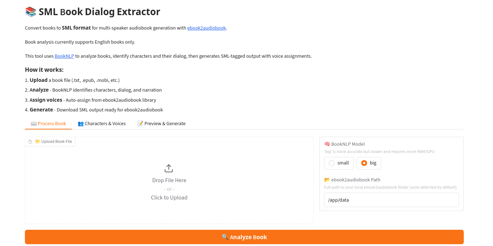

# E2A-SML: character voices for ebook2audiobook

E2A-SML uses BookNLP to find dialogue and speakers in an **English** book, lets you assign voices, and creates an SML text file for [ebook2audiobook](../../README.md). It runs separately from E2A.



## Quick start with Docker

From the E2A repository:

```bash
cd components/E2A-SML
docker compose up --build
```

Open **http://localhost:7861**. The first start downloads the voice library into `components/E2A-SML/data/`; later starts reuse it. The Docker container has its own voices and BookNLP models. The GUI lets you download the finished SML file from your browser.

## Local installation

Install [uv](https://docs.astral.sh/uv/getting-started/installation/) and use a separate Python 3.10 environment:

```bash
cd components/E2A-SML
uv venv --python 3.10 .venv
source .venv/bin/activate
uv pip install -r requirements.txt
uv pip install "$(python -m spacy info en_core_web_sm --url)"
python cli.py --gui
```

On Windows, activate with `.venv\Scripts\activate` instead. When run from this repository, the GUI finds the E2A voice library automatically. You can also enter the path to another E2A checkout in the GUI. Install [Calibre](https://calibre-ebook.com/download) to read formats other than `.txt` locally.

## Make an audiobook with E2A

1. In **Process Book**, upload an English book and select **Analyze Book**.
2. In **Characters & Voices**, review or change the assigned voices.
3. In **Preview & Generate**, select **Generate SML Output** and download the **path-based SML** file named `<book>.deprecated.sml.txt`.
4. Give that file to E2A as the book input. Its `voices/...` paths must refer to files in E2A's voice library. Run native E2A from its repository root; if you use separate containers, copy or mount the matching voices into E2A.

The filename says `deprecated` because E2A-SML also writes a newer character-name macro format. The path-based file is the one E2A currently accepts directly. The GUI also offers the macro SML and its `<book>.sml.json` voice map for editing or other workflows.

## Command line

With the local environment activated, run from `components/E2A-SML`:

```bash
python cli.py /path/to/book.txt --e2a-path /path/to/ebook2audiobook -o output/
```

Use `python cli.py --help` for model size, custom voice folders, and other options. Book analysis supports English only; `--language` changes the voice-library language, not BookNLP's analysis language. For non-`.txt` books, install Calibre locally or use Docker.
