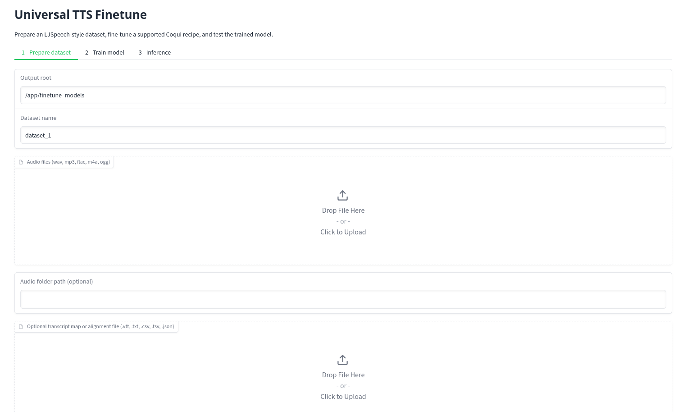
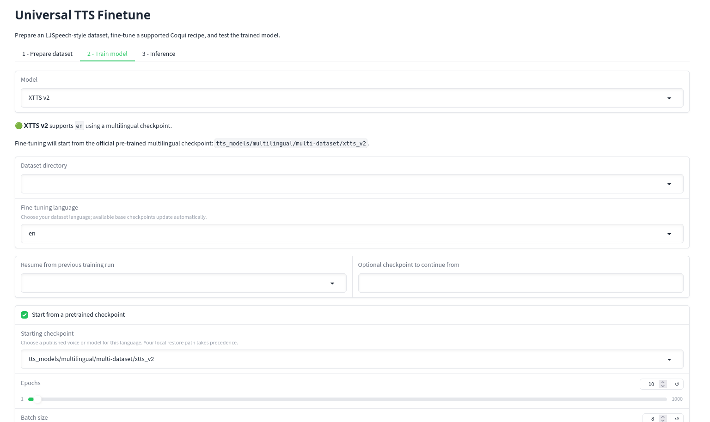

# Universal TTS Finetune

Prepare voice recordings, fine-tune a TTS model, and try it in a browser. This component runs separately from [ebook2audiobook](../../README.md) and supports 16 Coqui and Piper training engines.



## Quick start with Docker

From the E2A repository:

```bash
cd components/Universal_TTS_Finetune
docker compose up --build
```

Open **http://localhost:7862**. Put local recordings in `components/Universal_TTS_Finetune/audio_data/` and use `/app/audio_data` in the GUI. Datasets and trained models persist in `finetune_models/`; downloaded base models persist in `models/`. The supplied Compose file requests an NVIDIA GPU and needs the NVIDIA Container Toolkit.

## Install

Install [uv](https://docs.astral.sh/uv/getting-started/installation/) and use a separate Python 3.12 environment:

```bash
cd components/Universal_TTS_Finetune
uv venv --python 3.12 .venv
source .venv/bin/activate
uv pip install -r requirements.txt
python web_gui.py
```

On Windows, activate with `.venv\Scripts\activate` instead. Open **http://localhost:7862**. You can set `--out_path /path/to/output` and `--port 7862` when launching the GUI. A CUDA GPU speeds up training; CPU training can be slow.

## Fine-tune in three steps

1. **Prepare dataset:** Add audio clips and, if you have them, matching transcripts. You can also supply an E2A audiobook with its matching `.vtt` file. Without transcripts, the app uses Whisper. Select the dataset language and create the dataset.
2. **Train model:** Select the dataset, engine, and fine-tuning language. Choose a published **starting checkpoint** when one is available, then start training. Piper choices show language, locale, voice, and quality. A ready-to-speak Piper ONNX voice is different from a training checkpoint; UFT does not silently substitute an English checkpoint.
3. **Inference:** Select the finished run and generate a short sample. XTTS also needs a speaker reference WAV.

<details>
<summary>See the model and starting-checkpoint controls</summary>



</details>

The app stores prepared data under `<output_root>/dataset/` and finished models under `<output_root>/training_runs/<model>/<run>/ready/`. Keep `artifacts.json` with the model files so UFT can load the run later.

For an XTTSv2 model you want to use in E2A, follow E2A's [custom model ZIP instructions](../../README.md#example-of-custom-model-zip-upload). The XTTSv2 `ready/` folder contains the trained model, config, vocabulary, and reference audio needed for that package; E2A expects the reference audio named `ref.wav`.

## Command line

The same local environment also provides `headless_cli.py`. For example, with short Spanish WAV clips and a CSV whose columns are `audio,text`:

```bash
python headless_cli.py list-models
python headless_cli.py list-checkpoints --model vits_tts --language es
python headless_cli.py prepare-dataset \
  --audio-dir /path/to/wavs \
  --transcript-file /path/to/transcripts.csv \
  --language es \
  --output-root ./finetune_models
python headless_cli.py train \
  --model vits_tts \
  --language es \
  --dataset-dir ./finetune_models/dataset/LJSpeech-1.1 \
  --output-root ./finetune_models
```

The checkpoint list includes only mapped starting models for that engine and language. Use `--pretrained-model-id` to select one explicitly, or omit it for the default. `python headless_cli.py --help` lists the other commands; each command also has `--help`.
